# Simple Content Management System

## 项目愿景

Simple Content Management System 是一个灵活的内容管理系统，支持多后端存储、版本控制和元数据管理。系统采用清洁架构设计，提供RESTful API用于内容和对象操作，支持内存、文件系统和S3等多种存储后端。

## 架构总览

### 技术栈
- **语言**: Go 1.24+
- **Web框架**: Chi v5 (轻量级HTTP路由器)
- **数据库**: PostgreSQL (通过 pgx/v5)
- **存储**: 内存、文件系统、S3 (AWS SDK v2)
- **容器化**: Docker + Docker Compose
- **AI集成**: MCP (Model Context Protocol) 支持

### 架构模式
采用经典的分层架构模式，遵循依赖反转原则：
- **Domain Layer**: 核心业务实体和接口定义
- **Repository Layer**: 数据访问层，支持内存和PostgreSQL两种实现
- **Service Layer**: 业务逻辑层，协调仓储和存储
- **API Layer**: HTTP处理层，基于Chi路由器
- **Storage Layer**: 可插拔的存储后端实现
- **MCP Layer**: AI模型集成层，支持Model Context Protocol

## 模块结构图

```mermaid
graph TD
    A["(根) simple-content"] --> B["cmd"];
    A --> C["internal"];
    A --> D["pkg"];
    A --> E["tests"];
    
    B --> B1["server"];
    B --> B2["files"];
    B --> B3["mcpserver"];
    B --> B4["example"];
    B --> B5["s3test"];
    
    C --> C1["api"];
    C --> C2["domain"];
    C --> C3["mcp"];
    C --> C4["repository"];
    C --> C5["storage"];
    
    D --> D1["model"];
    D --> D2["repository"];
    D --> D3["service"];
    D --> D4["storage"];
    D --> D5["utils"];
    
    E --> E1["integration"];
    E --> E2["testutil"];

    click B1 "./cmd/server/CLAUDE.md" "查看 server 模块文档"
    click B2 "./cmd/files/CLAUDE.md" "查看 files 模块文档"
    click B3 "./cmd/mcpserver/CLAUDE.md" "查看 mcpserver 模块文档"
    click C1 "./internal/api/CLAUDE.md" "查看 api 模块文档"
    click C2 "./internal/domain/CLAUDE.md" "查看 domain 模块文档"
    click C3 "./internal/mcp/CLAUDE.md" "查看 mcp 模块文档"
    click D2 "./pkg/repository/CLAUDE.md" "查看 repository 模块文档"
    click D3 "./pkg/service/CLAUDE.md" "查看 service 模块文档"
    click D4 "./pkg/storage/CLAUDE.md" "查看 storage 模块文档"
    click E "./tests/CLAUDE.md" "查看 tests 模块文档"
```



## 模块索引

| 模块路径 | 职责描述 | 关键文件 |
|---------|---------|---------|
| `cmd/server` | 主服务入口，启动HTTP服务器 | main.go |
| `cmd/files` | 文件上传服务，PostgreSQL+S3生产环境入口 | main.go |
| `cmd/mcpserver` | MCP (Model Context Protocol) AI集成服务器 | main.go |
| `cmd/example` | 示例程序和演示代码 | main.go |
| `cmd/s3test` | S3存储功能测试工具 | main.go |
| `internal/api` | HTTP处理层，路由和控制器 | *_handler.go |
| `internal/domain` | 核心业务实体和常量定义 | content.go, object.go |
| `internal/mcp` | MCP协议处理器，AI工具实现 | handler.go |
| `pkg/repository` | 数据访问层实现 | memory/, psql/ |
| `pkg/service` | 业务逻辑层 | *_service.go |
| `pkg/storage` | 存储后端实现 | fs/, memory/, s3/ |
| `pkg/utils` | 通用工具函数库 | utils.go |
| `tests` | 集成测试和测试工具 | integration/, testutil/ |

## 运行与开发

### 快速启动
```bash
# 1. 克隆项目
git clone https://github.com/tendant/simple-content.git
cd simple-content

# 2. 本地开发启动 (内存模式)
make run

# 3. 生产环境启动 (PostgreSQL+S3)
./dist/cmd/files

# 4. AI集成启动 (MCP服务器)
./dist/cmd/mcpserver

# 5. Docker 环境启动
docker network create simple-content-network
docker compose up --build
```

### 开发环境
- **主服务端口**: 8080 (HTTP API)
- **文件服务端口**: 8080 (生产级API)  
- **MCP服务端口**: 8000 (AI集成)
- **健康检查**: http://localhost:8080/health
- **MinIO Console**: http://localhost:9001 (admin/minioadmin)

### 构建命令
```bash
make all          # 构建所有二进制
make docker-build # 构建Docker镜像
make clean        # 清理构建产物
make dep          # 整理依赖
```

## 测试策略

### 测试分类
- **单元测试**: 每个service和repository都有对应的*_test.go文件
- **集成测试**: tests/integration/ 目录下测试完整业务流程
- **存储测试**: 各存储后端都有专门的测试文件
- **AI集成测试**: MCP工具和协议的端到端测试

### 测试运行
```bash
go test ./...                          # 运行所有测试
go test -v ./pkg/service/...          # 运行服务层测试
go test -v ./tests/integration/...    # 运行集成测试
go test -cover ./...                  # 运行带覆盖率的测试
```

### 测试覆盖率
当前测试覆盖的关键组件：
- ✅ Content Service (内容服务)
- ✅ Object Service (对象服务)
- ✅ Repository层 (内存和PostgreSQL实现)
- ✅ Storage层 (文件系统和S3实现)
- ✅ 集成测试 (衍生内容、S3后端)
- ✅ API处理层 (HTTP端点测试)
- ⚠️ MCP模块缺少专门测试覆盖

## 编码规范

### Go代码规范
- 遵循标准Go代码规范和gofmt格式化
- 接口定义在使用方包中（dependency inversion）
- 错误处理使用标准error接口
- 结构体字段使用json标签标注
- 使用context.Context进行超时和取消控制

### 项目约定
- **命名**: 包名使用小写，结构体用PascalCase
- **目录结构**: 遵循Go标准项目布局
- **依赖注入**: 使用构造函数注入依赖
- **状态管理**: 使用常量定义状态值
- **日志记录**: 使用slog统一日志记录

### 数据库约定
- 使用UUID作为主键
- 时间字段统一使用time.Time类型
- 元数据使用JSONB存储
- 软删除通过status字段实现

### API设计约定
- RESTful风格的URL设计
- 统一的JSON请求响应格式
- HTTP状态码的正确使用
- 错误信息的标准化返回

## AI 使用指引

### 关键设计原则
1. **分层架构**: 严格遵循Domain → Service → Repository → Storage的依赖方向
2. **接口抽象**: 所有外部依赖都通过接口抽象，便于测试和替换
3. **插拔式存储**: 存储后端可以动态注册和配置
4. **版本控制**: 内容支持多版本，每个版本可存储在不同后端
5. **AI友好**: 通过MCP协议提供AI模型工具调用能力

### 扩展点
- **新存储后端**: 实现Storage接口即可接入新的存储系统
- **新元数据类型**: 通过JSONB字段存储结构化元数据
- **预览生成**: 通过ObjectPreview实体支持多种预览类型
- **审计追踪**: 通过AuditEvent记录所有操作
- **新MCP工具**: 在MCP Handler中添加新的AI工具
- **多租户支持**: 通过TenantID实现数据隔离

### 常见开发场景
- **添加新API端点**: 在api包中添加handler方法
- **扩展业务逻辑**: 在service包中添加业务方法  
- **新增数据表**: 在domain包中定义实体，在repository包中实现访问
- **添加存储后端**: 实现storage接口并注册到ObjectService
- **集成AI功能**: 通过MCP协议添加新的AI工具

### 部署模式选择
- **开发测试**: cmd/server (内存存储，快速启动)
- **生产环境**: cmd/files (PostgreSQL+S3，完整功能)
- **AI集成**: cmd/mcpserver (MCP协议，Claude等AI工具)
- **容器化**: Docker Compose (完整生态，一键部署)

## 变更记录 (Changelog)

### 2025-09-05 10:41:03 - AI上下文完整初始化
- 🎯 **完成**: 完整扫描并生成所有13个模块的CLAUDE.md文档
- 📋 **新增**: 创建cmd/files、cmd/mcpserver、internal/api、internal/mcp、tests模块文档
- 🏗️ **更新**: 完善Mermaid架构图，增加新发现的模块链接
- 📊 **扫描覆盖率**: ~92% (识别67个Go文件，分析覆盖62个关键文件)
- 🔗 **导航**: 建立完整的模块间导航体系和面包屑链接
- 🤖 **AI增强**: 新增MCP (Model Context Protocol) AI集成能力
- 💡 **文档质量**: 所有模块文档包含职责、接口、配置、测试、FAQ完整结构

### 2025-09-04 15:26:32 - AI上下文初始化
- 🎯 创建项目AI上下文文档
- 📋 识别并记录8个核心模块
- 🏗️ 生成Mermaid架构图
- 📊 初始化扫描覆盖率: ~85% (43/51个Go文件已分析)
- 🔗 建立模块间导航体系